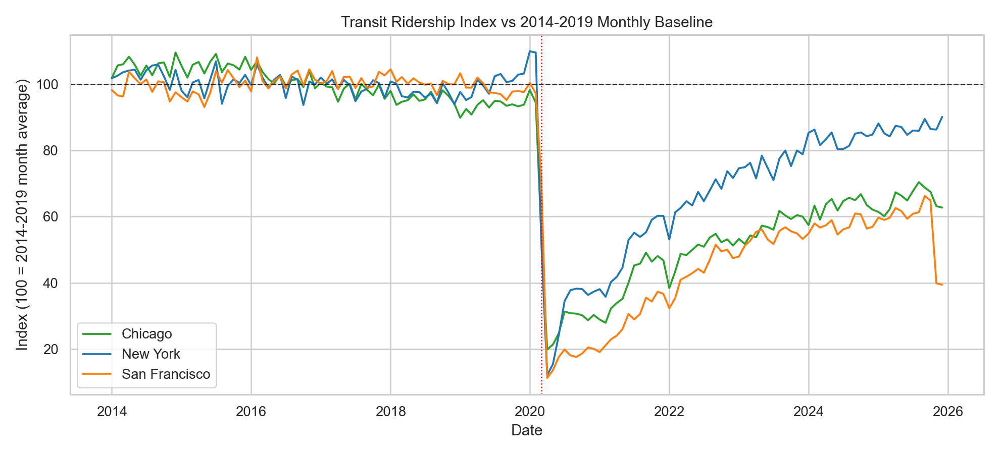
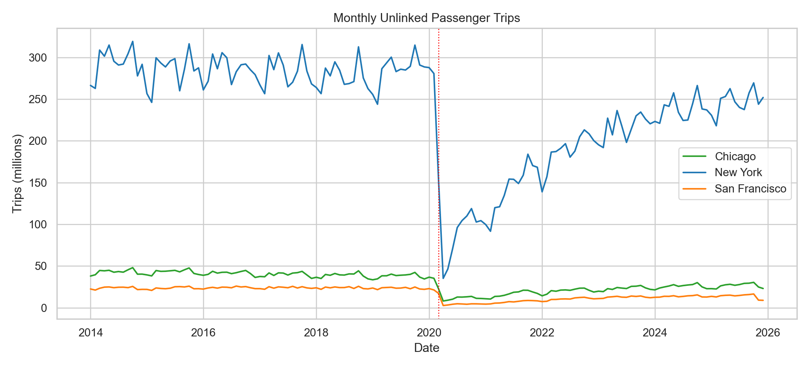
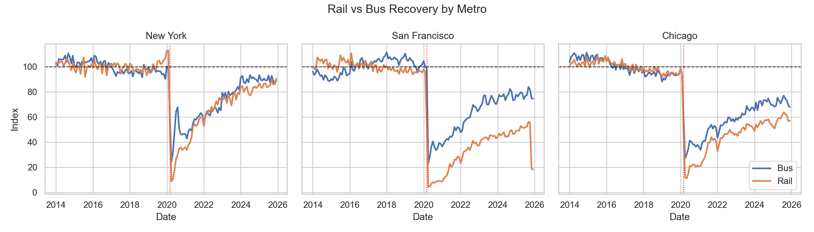
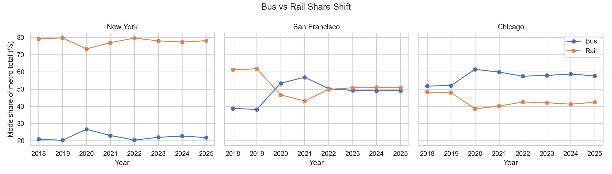

# Public Transport Recovery Deep Dive (NYC, San Francisco, Chicago)

## TL;DR
- Ridership collapsed in all three metros in April 2020, to roughly `11%` to `20%` of pre-COVID seasonal baseline.
- By 2025, New York recovered the most (`86.7%` of 2019 annual volume), Chicago is mid-recovery (`70.0%`), and San Francisco lags (`58.9%`).
- Bus has recovered better than rail in every metro, especially San Francisco (bus share up `+10.9` percentage points vs 2019).
- Structural recovery patterns suggest commuter rail demand remains persistently weaker than pre-COVID levels.

## Data, Sources, and Methodology

### Nature of Data
- Monthly **Unlinked Passenger Trips (UPT)** from the U.S. National Transit Database (NTD).
- UPT measures boardings, not unique people (a trip with transfers can count multiple boardings).
- Coverage window: `2014-01` to `2025-12`.

### Source
- U.S. DOT / FTA NTD Monthly Modal Time Series (public):  
  [https://data.transportation.gov/Public-Transit/Monthly-Modal-Time-Series-by-Mode-of-Transportation-/5ti2-5uiv](https://data.transportation.gov/Public-Transit/Monthly-Modal-Time-Series-by-Mode-of-Transportation-/5ti2-5uiv)

### Method Followed
- Metro definitions:
  - New York: MTA NYCT `HR` + `MB`
  - San Francisco: BART `HR` + Muni `LR` + Muni `MB`
  - Chicago: CTA `HR` + `MB`
- Baseline: seasonal month-level average from `2014-01` to `2019-12`.
- Main metric: `Index = (monthly UPT / baseline UPT for same month) * 100`.
- Recovery milestones computed on 3-month moving average index (`3MMA`) after trough date.

## Key Insights, Interpretations, and Visualizations

### 1) Overall recovery diverged sharply after the shared shock
**Insight:** All cities hit trough in April 2020, but only New York approached baseline by late 2025.  
**Interpretation:** A common pandemic shock was followed by city-specific recovery paths linked to network mix and commute dependence.

| Metro | Trough (Apr 2020 index) | First 50% (3MMA) | First 75% (3MMA) | 2025 avg index |
|:--|--:|:--|:--|--:|
| New York | 12.2 | 2021-07 | 2023-03 | 86.7 |
| Chicago | 19.9 | 2022-07 | Not reached | 65.2 |
| San Francisco | 11.3 | 2022-11 | Not reached | 57.9 |

### 2) Absolute rider volume recovery still leaves a large gap vs pre-COVID
**Insight:** Raw monthly volume recovered materially but remains below pre-pandemic magnitudes, especially in San Francisco and Chicago.  
**Interpretation:** Recovery in percentages can look strong while absolute scale remains structurally reduced.

| Metro | 2019 annual UPT | 2025 annual UPT | 2025 vs 2019 |
|:--|--:|--:|--:|
| New York | ~3.49B | ~3.03B | 86.7% |
| Chicago | ~395M | ~277M | 70.0% |
| San Francisco | ~182M | ~107M | 58.9% |

### 3) Bus recovered better than rail across all metros
**Insight:** 2025 bus index exceeds rail index in every city.  
**Interpretation:** Commuter-oriented rail has had slower return than bus-oriented, more distributed trip purposes.

| Metro | Bus index (2025 avg) | Rail index (2025 avg) |
|:--|--:|--:|
| New York | 89.8 | 85.9 |
| Chicago | 71.7 | 58.0 |
| San Francisco | 77.7 | 46.3 |

### 4) Mode mix shifted toward bus post-COVID
**Insight:** Bus share increased vs 2019 in each metro, with the strongest shift in San Francisco.  
**Interpretation:** Post-COVID travel behavior appears less centered on traditional CBD rail commute patterns.

| Metro | Bus share 2019 | Bus share 2025 | Change (pp) |
|:--|--:|--:|--:|
| New York | 20.1% | 21.8% | +1.7 |
| Chicago | 52.3% | 57.6% | +5.3 |
| San Francisco | 38.2% | 49.1% | +10.9 |

## Detailed Findings
- All metros show deep and immediate COVID shock with lowest monthly index in `2020-04`.
- New York is the only city in this set to exceed a `75` index recovery milestone on 3MMA (by `2023-03`).
- Neither Chicago nor San Francisco reaches a `75` index 3MMA milestone through `2025-12`.
- San Francisco’s rail underperformance is the largest single drag on metro-level recovery.
- Chicago’s recovery is moderate overall but meaningfully stronger on bus than rail.

## Caveats
- UPT is not unique riders; transfer-heavy systems may appear larger in boarding-based metrics.
- Metro definitions are selected for cross-city comparability and do not necessarily equal official local total-system reporting scopes.
- This analysis is descriptive and does not causally attribute drivers.
